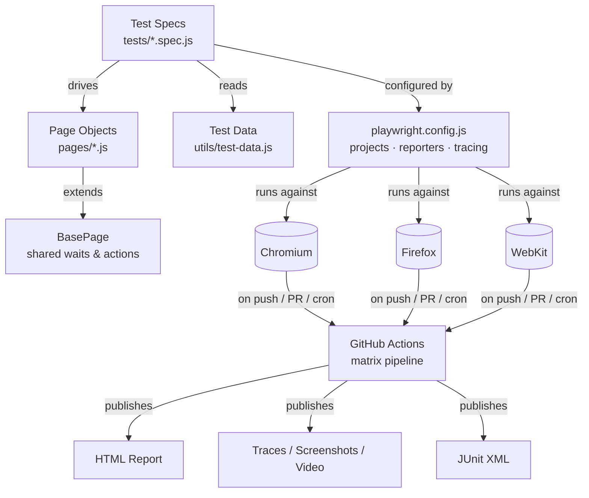
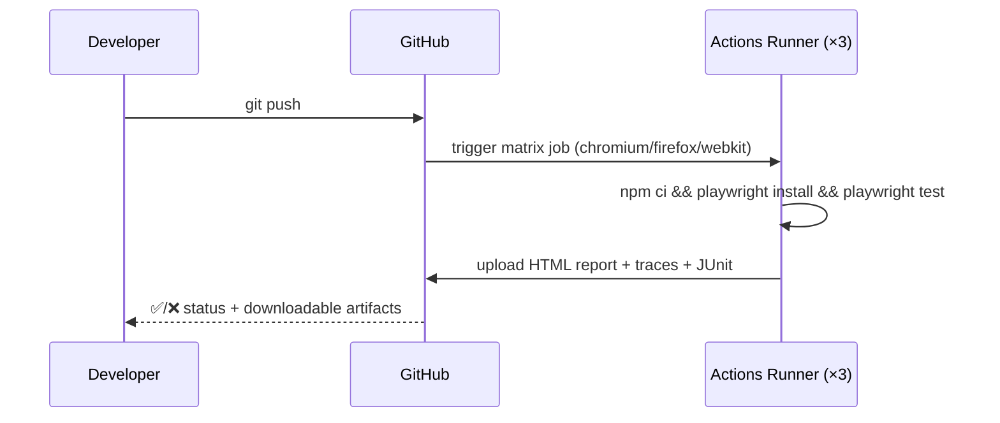

<div align="center">

# 🎭 Scalable E2E Web Automation Framework

**A production-grade end-to-end testing framework built with Playwright, JavaScript & GitHub Actions**

[](../../actions)
[](https://nodejs.org)
[](https://playwright.dev)
[](LICENSE)
[](CONTRIBUTING.md)
[](#-tech-stack)

[Getting Started](#-getting-started) •
[Test Coverage](#-test-coverage) •
[CI/CD](#-cicd-pipeline) •
[Architecture](#-architecture) •
[Contributing](#-contributing)

</div>

---

## 📖 Overview

This repository is a **scalable, maintainable end-to-end (E2E) test automation framework** designed the way a real QA/SDET team would build one for production use. It exercises critical business workflows — **authentication, data-driven forms, and dynamic UI interactions** — against [SauceDemo](https://www.saucedemo.com), a public demo app, so the suite is runnable out of the box. Point `BASE_URL` at your own application and the same architecture carries over unchanged.

> 💡 **Why this exists:** Most "toy" Playwright repos are a single flat `tests/` folder with hardcoded selectors. This framework instead demonstrates the patterns that keep a suite maintainable at scale — Page Object Model, centralized fixtures, tagged test subsets, cross-browser matrices, and a real CI/CD pipeline with artifact-based debugging.

---

## ✨ Features

| | |
|---|---|
| 🧩 **Page Object Model** | Every screen is a class — selectors and actions live in one place, not scattered across specs |
| 🌐 **Cross-Browser** | Chromium, Firefox, and WebKit run in parallel, both locally and in CI |
| 🔁 **CI/CD Native** | GitHub Actions matrix pipeline triggers on push, PR, manual dispatch, and nightly cron |
| 📊 **Rich Reporting** | HTML report, JUnit XML, screenshots, video, and full Trace Viewer support on failure |
| 🏷️ **Tagged Test Subsets** | `@smoke` and `@edge` tags let you run a fast subset without touching full regression |
| 🗂️ **Centralized Fixtures** | Users, products, and form data live in one file — no magic strings in specs |
| ⚙️ **Environment-Driven Config** | Swap `BASE_URL` via `.env` to point the whole suite at staging/prod/local |
| 🧪 **69 Tests, 23 Unique Flows** | Covers positive paths *and* edge/validation cases — not just happy paths |

---

## 🛠 Tech Stack

| Layer | Technology |
|---|---|
| Test Runner / Automation | [Playwright](https://playwright.dev) `^1.48.0` |
| Language / Runtime | JavaScript (CommonJS) on Node.js `>=18` |
| Design Pattern | Page Object Model (POM) |
| CI/CD | GitHub Actions (matrix builds) |
| Reporting | Playwright HTML Reporter, JUnit XML, Trace Viewer |
| Package Manager | npm |

---

## 🏗 Architecture



**Design rationale:** specs never touch selectors directly — they call methods on page objects, which inherit shared primitives (`click`, `fill`, `waitForUrl`, etc.) from `BasePage`. This means a UI change requires editing exactly **one** file, not every test that touches that screen.

---

## 📁 Project Structure

```
playwright-e2e-framework/
├── .github/workflows/
│   └── playwright.yml        # CI pipeline: matrix run across 3 browsers + artifact upload
├── pages/                    # Page Object Model
│   ├── BasePage.js           # Shared actions/waits used by every page object
│   ├── LoginPage.js          # Authentication workflow
│   ├── InventoryPage.js      # Dynamic UI: sorting, cart badge, add/remove
│   ├── CartPage.js           # Cart review
│   └── CheckoutPage.js       # Data input form + order summary
├── tests/                    # Test specs, grouped by workflow
│   ├── auth.spec.js          # Login: positive + edge cases
│   ├── inventory.spec.js     # Dynamic UI interactions
│   └── checkout.spec.js      # Data input forms: positive + validation/edge cases
├── utils/
│   └── test-data.js          # Centralized fixtures (users, products, form data)
├── playwright.config.js      # Cross-browser projects, reporters, tracing
├── package.json
└── .env.example
```

---

## 🚀 Getting Started

### Prerequisites
- [Node.js](https://nodejs.org) `>= 18`
- [Git](https://git-scm.com/downloads)

### 1️⃣ Clone & install
```bash
git clone https://github.com/cyber-sentinal106/playwright-e2e-framework.git
cd playwright-e2e-framework
npm install
```

### 2️⃣ Install browser binaries (one-time)
```bash
npx playwright install --with-deps
```
> On Windows, drop `--with-deps` (Linux-only flag): `npx playwright install`

### 3️⃣ Run the suite
```bash
npm test                              # all browsers, all tests
npm run test:chromium                 # single browser
npm run test:auth                     # single spec file
npx playwright test --grep @smoke     # tagged subset only
```

### 4️⃣ Debug
```bash
npm run test:headed   # watch the browser execute
npm run test:debug    # step through with Playwright Inspector
npm run test:ui       # interactive UI mode
npm run codegen       # record new tests by clicking through the app
```

### 5️⃣ View results
```bash
npm run report   # opens the last HTML report
```
On failure, Playwright also captures a **trace**, **screenshot**, and **video**:
```bash
npx playwright show-trace test-results/<failing-test-folder>/trace.zip
```

---

## 🧪 Test Coverage

| Spec | Covers | Tags |
|---|---|---|
| `auth.spec.js` | Valid login, logout, locked-out user, invalid credentials, empty-field validation, error dismissal, case-sensitivity edge case | `@smoke` `@edge` |
| `inventory.spec.js` | 4-way sorting (name/price asc/desc), dynamic cart badge updates on add/remove, empty-cart state, cart persistence across pages | `@smoke` `@edge` |
| `checkout.spec.js` | End-to-end checkout, subtotal/tax/total calculation, missing-field validation per required input, cancel-and-return flow | `@smoke` `@edge` |

<div align="center">

**23 unique test cases × 3 browsers = 69 total executions per run**

</div>

---

## 🔄 CI/CD Pipeline

The pipeline lives at [`.github/workflows/playwright.yml`](.github/workflows/playwright.yml):

- ⚡ **Triggers:** push/PR to `main`, manual `workflow_dispatch`, and a nightly cron (`03:00 UTC`)
- 🧵 **Matrix job:** Chromium, Firefox, and WebKit run in **parallel**, each on its own runner
- 🛡️ **`fail-fast: false`:** one browser failing doesn't cancel the others — you always get full signal
- 📦 **Artifacts published on every run** (14-day retention):
  - HTML report
  - JUnit XML (for dashboard integrations)
  - Traces, screenshots, and video **on failure**
- 📋 **Summary job** aggregates artifact locations once the matrix completes



---

## ⚙️ Configuration

Copy `.env.example` to `.env` and adjust:
```env
BASE_URL=https://www.saucedemo.com
```
`playwright.config.js` reads `BASE_URL`, so the same suite can target staging, QA, or production by changing **one variable** — zero code edits required.

---

## 🧭 Design Decisions

| Decision | Why |
|---|---|
| **Page Object Model** | Isolates selectors from test logic — a UI change means editing one file, not every test |
| **`BasePage` parent class** | Removes repeated waiting/clicking/filling boilerplate across page objects |
| **Centralized `test-data.js`** | Avoids hardcoded strings scattered across specs; trivial to add new fixtures |
| **`@smoke` / `@edge` tags** | Enables fast CI feedback loops without running full regression on every commit |
| **`trace: 'on-first-retry'`** | Keeps CI fast by only capturing expensive traces when a test actually flakes/fails |
| **Matrix CI with `fail-fast: false`** | Guarantees full cross-browser signal even if one engine has a real regression |

---

## 🧩 Extending the Framework

- **New page/flow:** add a page object under `pages/` extending `BasePage` → add fixtures to `utils/test-data.js` → add a spec under `tests/`
- **New browser/device:** add an entry to the `projects` array in `playwright.config.js` (mobile viewports are already stubbed behind the `@mobile` tag)
- **Scale parallelism:** `fullyParallel: true` is already set — increase CI `workers` as the suite and runner capacity grow

---

## 🤝 Contributing

Contributions are welcome! To propose a change:

1. Fork the repo and create a branch: `git checkout -b feature/my-improvement`
2. Make your changes, following the existing POM structure
3. Run the full suite locally: `npm test`
4. Commit with a clear message and open a Pull Request

Please keep new specs tagged appropriately (`@smoke` for critical-path, `@edge` for validation/boundary cases) so CI filtering keeps working.

---

## 🗺 Roadmap

- [ ] Visual regression testing with Playwright snapshots
- [ ] API-layer test coverage alongside UI tests
- [ ] Dockerized test execution for fully reproducible environments
- [ ] Slack/Teams notification step on CI failure
- [ ] Allure reporting integration

---

## 📄 License

Distributed under the MIT License. See [`LICENSE`](LICENSE) for details.

---

<div align="center">

Built with ❤️ using Playwright — cross-browser testing, done right.

</div>
